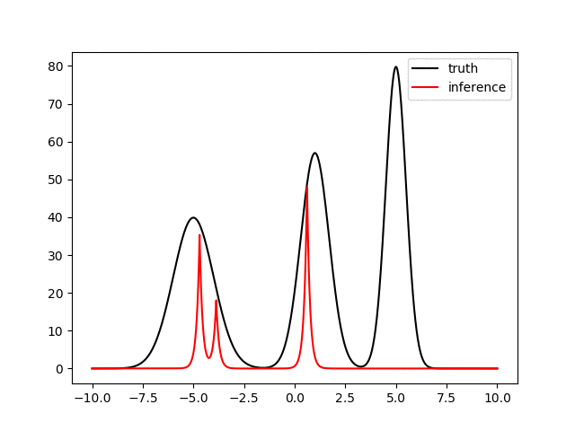
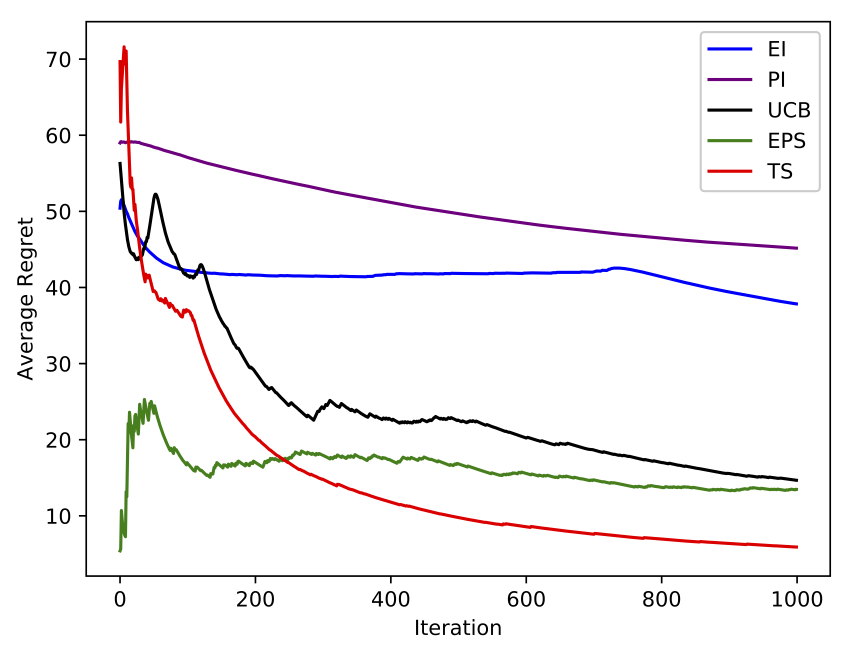

# mrf-approximator

A light-weighted, installation-free, general purpose discrete function approximator based on Markov random field.
  - Arbitrary multivariable function support (1,2,3-D)
  - CTR Simulation is provided
  - Faster than Sklearn's Gaussian process regression on large training data
  - Discrete input space size is advised to be limited to around 3000 due to O(n^2) computational cost

You can also:
  - Test the model on customized environment function by modifying testconf.py
  - Implement and test customized learning algorithm by extending class MetaPolicy
  - Bootstrap some training data for other machine learning application with insufficient data

### Dependency
| package name | 
| ------ |
| Anaconda 3 |
| JRE 1.7 or newer (if CTR simulation is used)|
| imageMagick (if animation option is used)| 

### Example Usage
```sh
$ git clone https://github.com/vivi489/mrf-approximator.git
$ cd mrf-approximator
$ python test.py 1 30
```
The above execution trains a model to learn a 1D function for 30 trials.



### Training Loss
Training losses from different policies are plotted in running average.


